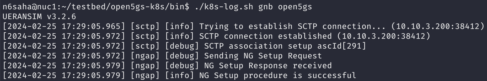
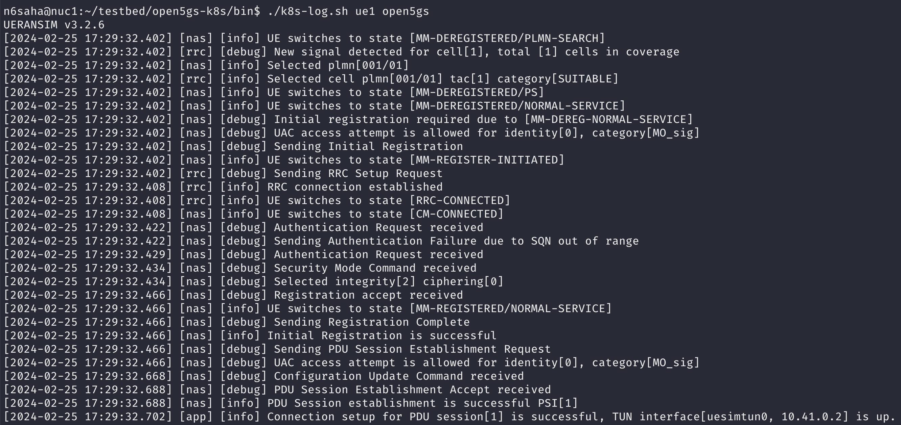
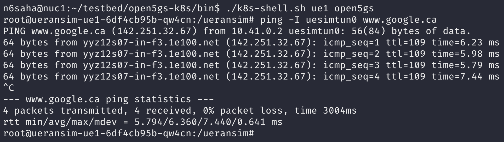

# open5gs-k8s

This repository contains the necessary files and resources to deploy and operate Open5GS, an open-source 5G core network implementation. It provides Kubernetes manifest files for deploying Open5GS using microservices, an all-in-one deployment variant, and Open5GS WebUI. Additionally, there are manifest files for deploying the MongoDB database and network attachment definitions for Open5GS.

For more information about Open5GS, please visit the [Open5GS GitHub repository](https://github.com/open5gs/open5gs).


## Directory Structure

The repository is organized as follows:

- `open5gs/`: Contains Kubernetes manifest files for deploying open5gs using a microservices architecture.
- `open5gs-webui/`: Contains Kubernetes manifest files for deploying the open5gs WebUI.
- `mongodb/`: Contains Kubernetes manifest files for deploying the MongoDB database, which is a prerequisite for deploying open5gs.
- `networks5g/`: Contains network attachment definitions for open5gs. 
- `ueransim/`: Contains Kubernetes files for running UERANSIM-based simulated gNB and UEs.
- `data/`: Contains slice and subscriber configuration data.
- `mongo-tools/`: Contains python scripts for adding/removing subscription data and automating generation of configuration files for multi-slice deployments.
- `msd`: Multi-slice deployment of open5gs and ueransim, with configurable number of slices.

## Deployment

**Note**: The deployment instructions assume a working kubernetes cluster with OVS CNI installed. You can optionally use the [testbed-automator](https://github.com/niloysh/testbed-automator) to prepare the Kubernetes cluster. This includes setting up the K8s cluster, configuring the cluster, installing various Container Network Interfaces (CNIs), configuring OVS bridges, and preparing for the deployment of the 5G Core network.

To deploy open5gs and its components, follow the deployment steps below:

1. Set up OVS bridges. On each K8s cluster node, add the OVS bridges: n2br, n3br, and n4br. Connect nodes using these bridges and OVS-based VXLAN tunnels. See [ovs-cni docs](https://github.com/k8snetworkplumbingwg/ovs-cni/blob/main/docs/demo.md#connect-bridges-using-vxlan).

    <details>
    <summary>Example command for creating VXLAN tunnels</summary>

    ```bash
    sudo ovs-vsctl add-port n2br vxlan_nuc1_n2 -- set Interface vxlan_nuc1_n2 type=vxlan options:remote_ip=<remote_ip> options:key=1002
    ```
    </details>  

<br>

**Note**: The testbed-automator scripts automatically configures the OVS bridges for a single-node cluster setup, and VXLAN tunnel creation is not required. For a multi-node cluster configuration, VXLAN tunnels are used for node interconnectivity.

2. Deploy the MongoDB database using the Kubernetes manifest files provided in the `mongodb/` directory. See [deploying components](#deploying-components). Wait for the mongodb pod to be in the `Running` state before proceeding to the next step.

3. Deploy the network attachment definitions using manifest files in the `networks5g/` directory. This are used for the secondary interfaces of the UPF, SMF, etc.

4. Generate configuration files for slices and subscribers. Use `mongo-tools/generate-data.py` to generate the configuration files. See [Using python scripts](#using-python-scripts). This step will create `slices.yaml` and `subscribers.yaml` in the `data/` directory.
   
5. Deploy open5gs using the Kubernetes manifest files in the `open5gs/` directory. The pods should eventually be in the `Running` state. 


6. Deploy the open5gs WebUI using the Kubernetes manifest files in the `open5gs-webui/` directory. The WebUI should be accessible at `http://<node_ip>:30300`.

7. The `ueransim` directory contains Kubernetes manifest files for both gNB and UEs. First, deploy UERANSIM gNB using `ueransim/ueransim-gnb` directory and wait for NGAP connection to succeed. 



8. Ensure correct UE subscriber information is inserted. You can enter subscription information either using the CLI (`add-subscribers.py` script in `mongo-tools`). Alternatively, you can use the web UI (see [accessing the Open5GS webui](#accessing-the-open5gs-webui)). Subscriber details can be found in `data/subscribers.yaml`.

9.  Deploy UERANSIM UEs using `ueransim/ueransim-ue/` directory.

The UEs should connect to the gNB and establish a PDU session with the 5G core network.

<details>
<summary>UE log</summary>



</details>

<details>
<summary>UE ping test</summary>



</details>


### Using python scripts
This project uses python scripts for managing subscription data and automating generation of manifests for multi-slice deployments. Use the following steps to setup a virtual environment.

```bash
sudo apt-get install python3-pip
sudo pip3 install virtualenv
virtualenv venv
source venv/bin/activate
pip -r requirements.txt
```

**Note**: Please cd into `mongo-tools` before running the python scripts.

### Deploying components
We use [kustomize](https://kustomize.io/) to deploy the components.

Deploy all components in the open5gs namespace. Create the namespace if needed (`kubectl create namespace open5gs`). Use the following command for deployment, replacing <component> (e.g., open5gs-webui, open5gs) as needed:

```bash
kubectl apply -k <component> -n open5gs
```


### Accessing the Open5GS webui
1. We need to add the default admin account before accessing the webui. This can be done using the python scripts (See [Using python scripts](#using-python-scripts)). Use `mongo-tools/add-admin-account.py`
2. The Open5GS webui is configured to run on port 30300. 


### IP Ranges
This project uses overlay IPs for tunnels deployed with the OVS-CNI in Kubernetes. The CNI configuration is outlined in the `networks5g/`. 

- `n2network` as IP `10.10.2.0/24`, `n3network` has IP `10.10.3.0/24`, `n4network` has IP `10.10.4.0/24`.
- Due to constraints in srsRAN, both AMF and gNB currently utilize the `n3network` instead of `n2network`.
- UPF N3 IP range is from `10.10.3.X` from `UPFX`. UPF N4 IP range is from `10.10.4.X` for `UPFX`.
- SMF N4 IP range is from `10.10.4.{100 + X}` from `SMFX`
- AMF IP range is from `10.10.3.200` to `10.10.3.230`.
- gNB IP range is from `10.10.3.231` to `10.10.3.250`.

Please use the above conventions when connecting external gNBs, e.g., srsRAN.


## Scripts
The `bin` directory contains scripts for easily viewing logs and getting a shell on any of the NFs. Usage is as follows.
```bash
   ./k8s-log.sh <nf> <namespace>
   ./k8s-log.sh amf open5gs
```


## License

This repository is licensed under the [MIT License](LICENSE).
