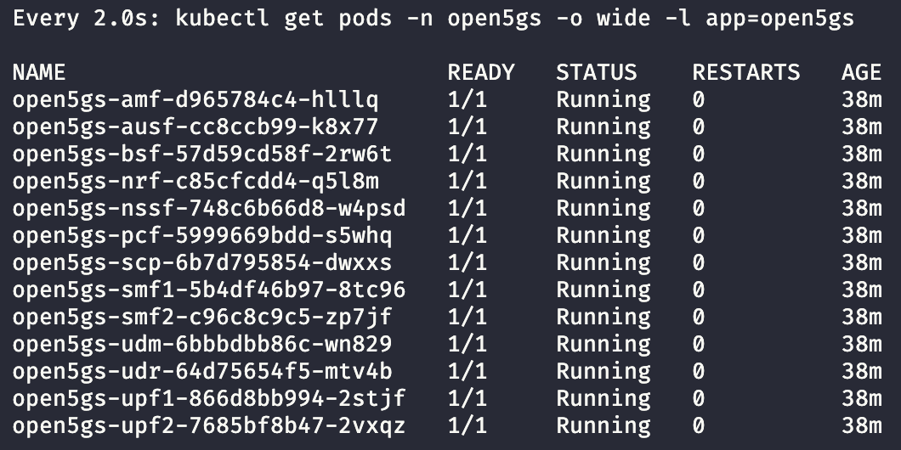
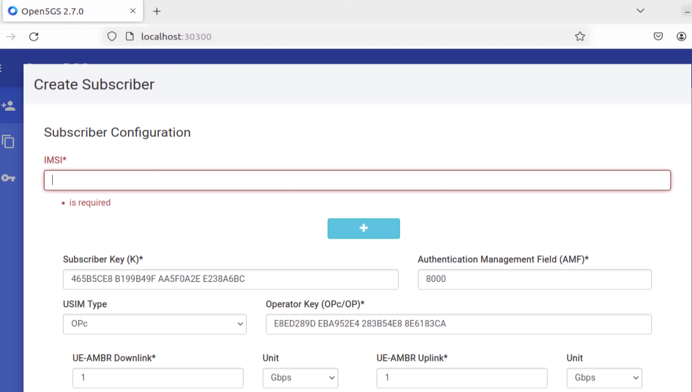

# open5gs-k8s

This repository contains the necessary files and resources to deploy and operate Open5GS, an open-source 5G core network implementation. It provides Kubernetes manifest files for deploying Open5GS using microservices, an all-in-one deployment variant, and Open5GS WebUI. Additionally, there are manifest files for deploying the MongoDB database and network attachment definitions for Open5GS.

For more information about Open5GS, please visit the [Open5GS GitHub repository](https://github.com/open5gs/open5gs).


## Table of Contents

- [open5gs-k8s](#open5gs-k8s)
  - [Table of Contents](#table-of-contents)
- [Requirements](#requirements)
- [Directory Structure](#directory-structure)
- [Deployment](#deployment)
  - [Step 1: Create a namespace for deploying Open5GS](#step-1-create-a-namespace-for-deploying-open5gs)
  - [Step 2: Deploy MongoDB](#step-2-deploy-mongodb)
    - [Deploy MongoDB with Kustomize](#deploy-mongodb-with-kustomize)
    - [Check MongoDB Pod Status](#check-mongodb-pod-status)
  - [3. Deploy the Network Attachment Definitions (NAD) for Multus](#3-deploy-the-network-attachment-definitions-nad-for-multus)
    - [Apply Network Attachment Definitions](#apply-network-attachment-definitions)
    - [Verify the Network Attachment Definitions](#verify-the-network-attachment-definitions)
  - [4. Deploying Open5gs](#4-deploying-open5gs)
    - [Deploy Open5GS components](#deploy-open5gs-components)
      - [1. Standard Deployment:](#1-standard-deployment)
      - [2. Deployment with Monarch for Monitoring:](#2-deployment-with-monarch-for-monitoring)
    - [Check Deployment status](#check-deployment-status)
    - [Verifying Deployment](#verifying-deployment)
  - [5. Adding subscriber data](#5-adding-subscriber-data)
    - [Deploy the Open5GS WebUI](#deploy-the-open5gs-webui)
    - [Setting up the Admin Account](#setting-up-the-admin-account)
    - [Accessing the WebUI](#accessing-the-webui)
      - [Accessing the WebUI locally](#accessing-the-webui-locally)
      - [Accessing the WebUI over SSH](#accessing-the-webui-over-ssh)
    - [Adding subscribers](#adding-subscribers)
    - [Using python scripts](#using-python-scripts)
      - [1. Set up a virtual Environment](#1-set-up-a-virtual-environment)
      - [2. Adding the admin account](#2-adding-the-admin-account)
      - [3. Adding Subscriber information using the CLI](#3-adding-subscriber-information-using-the-cli)
  - [6. Deploying the UERANSIM gNB](#6-deploying-the-ueransim-gnb)
    - [Step 1: Deploy UERANSIM gNB](#step-1-deploy-ueransim-gnb)
    - [Step 2: Verify the NGAP connection](#step-2-verify-the-ngap-connection)
    - [Step 3: Check AMF logs](#step-3-check-amf-logs)
  - [7. Deploying the UERANSIM UEs](#7-deploying-the-ueransim-ues)
    - [Step 1: Deploy UEs](#step-1-deploy-ues)
    - [Step 2: Verify UE deployment](#step-2-verify-ue-deployment)
    - [Step 3: Check UE logs](#step-3-check-ue-logs)
    - [Step 4: Conduct a ping test](#step-4-conduct-a-ping-test)
    - [Step 5: Test Connectivity](#step-5-test-connectivity)
    - [Step 6: Verify traffic through the 5G network](#step-6-verify-traffic-through-the-5g-network)
  - [Utilities](#utilities)
    - [Viewing Logs](#viewing-logs)
    - [Accessing a Shell](#accessing-a-shell)
  - [IP Ranges](#ip-ranges)
  - [License](#license)


# Requirements
- Supported OS: **Ubuntu 22.04 LTS** (recommended) or Ubuntu 20.04 LTS
- Minimum hardware: **4 cores, 4GB RAM**
- Kubernetes **v1.28 with Multus and OVS-CNI**: We recommend using the [testbed-automator](https://github.com/niloysh/testbed-automator) to prepare the Kubernetes cluster. This includes setting up the K8s cluster, configuring the cluster, installing various Container Network Interfaces (CNIs), configuring OVS bridges, and preparing for the deployment of the 5G Core network.

# Directory Structure

The repository is organized as follows:

- `open5gs/`: Contains Kubernetes manifest files for deploying open5gs using a microservices architecture.
- `open5gs-webui/`: Contains Kubernetes manifest files for deploying the open5gs WebUI.
- `mongodb/`: Contains Kubernetes manifest files for deploying the MongoDB database, which is a prerequisite for deploying open5gs.
- `networks5g/`: Contains network attachment definitions for open5gs. 
- `ueransim/`: Contains Kubernetes files for running UERANSIM-based simulated gNB and UEs.
- `data/`: Contains slice and subscriber configuration data.
- `mongo-tools/`: Contains python scripts for adding/removing subscription data and automating generation of configuration files for multi-slice deployments.
- `msd`: Multi-slice deployment of open5gs and ueransim, with configurable number of slices.

# Deployment

Follow these steps to deploy Open5GS on a Kubernetes cluster configured with [testbed-automator](https://github.com/niloysh/testbed-automator).

> [!NOTE]
> The testbed-automator defaults to a single-node cluster setup. However, if you prefer a multi-node cluster, follow the instructions for  [multi-node deployment](https://github.com/niloysh/testbed-automator?tab=readme-ov-file#multi-node-deployment). The steps below are compatible with both single-node and multi-node setups without any additional modifications.

## Step 1: Create a namespace for deploying Open5GS
We will create a namespace for deploying all Open5GS components.

```bash
kubectl create namespace open5gs
```
You can verify the creation of namespace as follows.
```bash
kubectl get namespaces
```

## Step 2: Deploy MongoDB
MongoDB is used for storing subscriber information, NF profile information etc.
MongoDB is also used in interacting with the Open5GS WebUI.

**Note**: We will use [Kustomize](https://kustomize.io/), a Kubernetes-native configuration management tool. Kustomize enables you to customize Kubernetes manifest files without modifying the original YAML files directly, making it easier to manage deployments across different environments.

### Deploy MongoDB with Kustomize


```bash
kubectl apply -k mongodb -n open5gs
```
This command applies the MongoDB configuration using Kustomize, deploying MongoDB within the open5gs namespace. The manifests in this directory define the necessary resources for MongoDB, including StatefulSets, Services, and Persistent Volume Claims (PVCs), ensuring data persistence.

### Check MongoDB Pod Status

Once you’ve deployed MongoDB, check the status of the MongoDB pod to ensure it’s up and running. It may take a few moments for the pod to initialize, create the necessary volumes, and enter the READY state.
```bash
kubectl get pods -n open5gs

NAME        READY   STATUS    RESTARTS   AGE
mongodb-0   1/1     Running   0          42s
```

If the status shows as Running, MongoDB is ready, and you can proceed to the next step. If not, use the following command to view logs and troubleshoot potential issues:
```
kubectl logs mongodb-0 -n open5gs
```

## 3. Deploy the Network Attachment Definitions (NAD) for Multus
Network Attachment Definitions (NADs) enable secondary network interfaces for pods in Kubernetes using the Multus CNI plugin. For Open5GS, these secondary interfaces are critical, allowing components such as the User Plane Function (UPF) and Session Management Function (SMF) to connect to distinct network segments. This configuration leverages Open Virtual Switch (OVS) with OVS-CNI to create and manage virtual networks for Open5GS components.

In this deployment, NADs are set up to link specific interfaces to preconfigured OVS bridges (n2, n3, and n4), which should already be established by the testbed-automator. These OVS bridges represent logical networks for the N2, N3, and N4 interfaces as follows:

- N2: Control plane traffic between gNB and AMF.
- N3: User data traffic between gNB and UPF.
- N4: Control plane traffic between SMF and UPF.

> [!NOTE]
> You can verify the existence of the n2, n3, and n4 ovs bridges using the commands `sudo ovs-vsctl show`


### Apply Network Attachment Definitions
To deploy the NADs, apply the Kubernetes manifest files in the networks5g/ directory:
```bash
kubectl apply -k networks5g -n open5gs
```
This command will create three NADs (one each for n2, n3, and n4), allowing the UPF, SMF, and other Open5GS components to connect to these logical networks.

### Verify the Network Attachment Definitions
To confirm that the NADs are set up correctly, run the following command:
```bash
kubectl get network-attachment-definition -n open5gs

NAME        AGE
n2network   10s
n3network   10s
n4network   10s
```
You should see output similar to the above. These definitions will now allow specific Open5GS pods to use secondary network interfaces connected to the corresponding OVS bridges, enabling proper segmentation and routing of control and user plane traffic in the 5G core network.


## 4. Deploying Open5gs
The Open5GS deployment uses a microservices architecture to run each network function (NF) in separate containers as Kubernetes pods, providing flexibility and scalability. This setup allows for easy management and scaling of individual NFs, such as the AMF (Access and Mobility Management Function), SMF (Session Management Function), and UPF (User Plane Function), according to specific requirements.

In this deployment, Open5GS is configured to support two network slices. Each slice has its own dedicated instance of the SMF and UPF to handle slice-specific user and control plane traffic, while other NFs, like the AMF, are shared across slices.

### Deploy Open5GS components
To deploy Open5GS, apply the Kubernetes manifest files in the open5gs/ directory. These manifest files define each Open5GS NF as a separate pod, allowing the platform to operate in a distributed fashion.

Select one of the following deployment options based on your monitoring needs:

#### 1. Standard Deployment:
Deploys Open5GS network functions as separate pods for a distributed setup.
```bash
kubectl apply -k open5gs -n open5gs
```

#### 2. Deployment with Monarch for Monitoring:
[Monarch](https://github.com/niloysh/5g-monarch) is a network slice monitoring architecture for cloud native 5G network deployments.

This deployment option adds monitoring capabilities with Monarch for enhanced metrics tracking. Use this command instead of the standard deployment command.

```bash
kubectl apply -k msd/overlays/open5gs-metrics -n open5gs
```


This command will create pods for each Open5GS NF, including AMF, SMF, UPF, and additional components needed for 5G core functionality.

> [!NOTE]
> Starting the network functions (NFs) may take some time as dependencies are resolved, so they may initialize sequentially. Please allow time for each NF to start up fully.

### Check Deployment status
After deploying Open5GS, you can monitor the status of the pods to ensure they have all reached the Running state. Run the following command to check the status of all Open5GS pods:
```bash
kubectl get pods -n open5gs
```
You should see output similar to



Each NF pod should display the status Running. The SMF and UPF pods have been duplicated for each slice, as specified in the default configuration.

### Verifying Deployment

If any pods are not in the Running state, check the logs for troubleshooting:
```bash
kubectl logs <pod-name> -n open5gs
```

For example, on successfully running the AMF, you can check its logs as follows
```bash
kubectl logs open5gs-amf-d965784c4-688nv -n open5gs
```
You should see output similar to
```bash
Defaulted container "amf" out of: amf, wait-scp (init)
Open5GS daemon v2.7.0

10/30 21:23:03.616: [app] INFO: Configuration: '/open5gs/config/amfcfg.yaml' (../lib/app/ogs-init.c:130)
10/30 21:23:03.616: [app] INFO: File Logging: '/open5gs/install/var/log/open5gs/amf.log' (../lib/app/ogs-init.c:133)
10/30 21:23:03.619: [metrics] INFO: metrics_server() [http://0.0.0.0]:9090 (../lib/metrics/prometheus/context.c:299)
10/30 21:23:03.619: [sbi] INFO: NF Service [namf-comm] (../lib/sbi/context.c:1812)
10/30 21:23:03.620: [sbi] INFO: nghttp2_server() [http://10.244.0.35]:80 (../lib/sbi/nghttp2-server.c:414)
10/30 21:23:03.636: [amf] INFO: ngap_server() [10.10.3.200]:38412 (../src/amf/ngap-sctp.c:61)
10/30 21:23:03.636: [sctp] INFO: AMF initialize...done (../src/amf/app.c:33)
10/30 21:23:03.638: [sbi] INFO: [25c6ae14-9705-41ef-be93-9b9213babecb] NF registered [Heartbeat:10s] (../lib/sbi/nf-sm.c:221)
10/30 21:23:03.638: [sbi] INFO: [25c9bf96-9705-41ef-a6a1-afd4bf0905fe] Subscription created until 2024-10-31T21:23:03.638420+00:00 [duration:86400,validity:86399.999431,patch:43199.999715] (../lib/sbi/nnrf-handler.c:708)
```

## 5. Adding subscriber data

With the core network now up and running, we need to add subscriber data to enable connectivity. Open5GS provides a WebUI for adding and managing subscriber information. The WebUI can be accessed after deploying it with the Kubernetes manifest files in the open5gs-webui/ directory. Once deployed, it will be accessible at http://<node_ip>:30300.

### Deploy the Open5GS WebUI
Apply the Kubernetes manifest files from the open5gs-webui/ directory to deploy the WebUI.
```bash
kubectl apply -k open5gs-webui -n open5gs
```
### Setting up the Admin Account

> [!IMPORTANT]  
> Before accessing the WebUI, an admin account must be created. 


You can use the add-admin-account.py Python script located in mongo-tools/ to add the default admin account. This script simplifies setup by configuring the initial admin credentials directly in MongoDB. See [Adding the admin account](#2-adding-the-admin-account) section.

For detailed instructions on using this script, see the [Using Python Scripts](#using-python-scripts) section below.

### Accessing the WebUI

#### Accessing the WebUI locally
Once deployed, the Open5GS WebUI will run on port 30300 on the node where Open5GS is installed. To access it:

1.	Open a web browser.
2.	Navigate to http://<node_ip>:30300 (replace <node_ip> with the actual IP address of your deployment node).

Here, you can manage subscribers, view network statistics, and configure network functions as needed.

After adding the admin account, log in with:

- Username: `admin`
- Password: `1423`

> [!NOTE]
>  If you’re unable to log in, verify that the admin account was added by running the add-admin-account.py script, as outlined in the previous steps.

#### Accessing the WebUI over SSH
If you're accessing the Open5GS host remotely over SSH, you’ll need to forward the WebUI port to your local machine to access it in a browser.

To set up SSH port forwarding, run the following command on your local machine:
```bash
ssh -p 2222 -L 30300:127.0.0.1:30300 dev@127.0.0.1
```
Here:
- -p 2222 specifies the SSH port used for connecting to the node.
- -L 30300:127.0.0.1:30300 forwards your local port 30300 to port 30300 on the Open5GS node.

This SSH tunnel will redirect requests from your local port 30300 to port 30300 on the remote node, allowing access to the WebUI as though it were running locally.

Once connected, open your web browser and go to http://localhost:30300 to access the Open5GS WebUI.

You can add subscriber information such as IMSI, Subscriber Key, Operator Key, SNSSAI etc using the WebUI as shown below.



### Adding subscribers
Once you can access the WebUI, you can add the subscriber information. For testing with UERANSIM, you should add the subscriber information found in [data/sample-subscribers.md](data/sample-subscribers.md).

There are 3 sample subscribers configured to connect to two slices.

   
### Using python scripts
Python scripts are available in this project to help automate the management of subscriber data and simplify multi-slice configuration. These scripts can add, remove, and manage subscriber entries in the MongoDB database that Open5GS relies on. They can also generate necessary configuration files for multi-slice deployments.

#### 1. Set up a virtual Environment
First, set up a Python virtual environment to manage dependencies.

```bash
sudo apt-get install python3-pip
sudo pip3 install virtualenv
virtualenv venv
source venv/bin/activate
pip install -r requirements.txt
```

Once you have activated the virtual environment, you should see your terminal prompt display the venv as shown below:
```bash
(venv) dev@workshop-vm:~/open5gs-k8s$ 
```
This means your virtual environment is activated and now your can use the python scripts.

#### 2. Adding the admin account
Before accessing the WebUI, an admin account must be set up. To do this, use the add-admin-account.py Python script in the mongo-tools/ directory, which will automatically add a default admin account to the MongoDB database.

Run the script as follows:

```bash
python mongo-tools/add-admin-account.py
```
You should see an output similar to this, confirming the account creation:
```bash
2024-10-30 17:38:07 |     INFO | No accounts found. Adding admin account.
```

You can now go back to [Accessing the WebUI](#accessing-the-open5gs-webui) to add subscriber information.

Alternatively, you can also [add subscriber data from the command line](#3-adding-subscriber-information-using-the-cli). This may be particularly useful for batch operations or automated setups.

#### 3. Adding Subscriber information using the CLI

The python scripts can be used to add subscriber information. For details see [Add subscribers using CLI](add-subscribers-using-cli.md).

## 6. Deploying the UERANSIM gNB
Once the subscriber data is correctly inserted, we can move on to deploying the RAN.
UERANSIM can be used to deploy a simulated monolithic gNB.

### Step 1: Deploy UERANSIM gNB

The `ueransim` directory contains Kubernetes manifest files for both gNB and UEs. First, deploy UERANSIM gNB using `ueransim/ueransim-gnb` directory and wait for NGAP connection to succeed. 

```bash
kubectl apply -k ueransim/ueransim-gnb/ -n open5gs
```

### Step 2: Verify the NGAP connection

Verify that the NGAP connection is succesful from the gNB logs.
```bash
kubectl logs ueransim-gnb-<pod-name> -n open5gs
```
> [!NOTE] 
> Replace <pod-name> with the actual name of the gNB pod, which can be obtained by running kubectl get pods -n open5gs.

> [!TIP]
> Check out the section on [Utilities](#utilities) for a more convenient way to check logs.

You should see output indicating that the SCTP connection is established and the NG Setup procedure is successful, similar to the following:
```bash
UERANSIM v3.2.6
[2024-10-31 16:18:35.073] [sctp] [info] Trying to establish SCTP connection... (10.10.3.200:38412)
[2024-10-31 16:18:35.075] [sctp] [info] SCTP connection established (10.10.3.200:38412)
[2024-10-31 16:18:35.075] [sctp] [debug] SCTP association setup ascId[4549]
[2024-10-31 16:18:35.075] [ngap] [debug] Sending NG Setup Request
[2024-10-31 16:18:35.082] [ngap] [debug] NG Setup Response received
[2024-10-31 16:18:35.082] [ngap] [info] NG Setup procedure is successful
```
### Step 3: Check AMF logs

We should also be able to see the logs from the AMF indicating a successful NGAP connection with the gNB.

```bash
kubectl logs -f open5gs-amf-d965784c4-cxvgt -n open5gs
```
You should see log entries indicating the successful registration of the gNB, such as:
```bash
10/31 18:06:17.538: [sbi] INFO: (NRF-notify) NF registered [d3371fa4-97b2-41ef-acbb-55f392fb7b64:1] (../lib/sbi/nnrf-handler.c:924)
10/31 18:06:17.538: [sbi] INFO: [NSSF] (NRF-notify) NF Profile updated [d3371fa4-97b2-41ef-acbb-55f392fb7b64:1] (../lib/sbi/nnrf-handler.c:938)
10/31 18:10:50.260: [amf] INFO: gNB-N2 accepted[10.10.3.231]:53505 in ng-path module (../src/amf/ngap-sctp.c:113)
10/31 18:10:50.260: [amf] INFO: gNB-N2 accepted[10.10.3.231] in master_sm module (../src/amf/amf-sm.c:741)
10/31 18:10:50.273: [amf] INFO: [Added] Number of gNBs is now 1 (../src/amf/context.c:1231)
10/31 18:10:50.273: [amf] INFO: gNB-N2[10.10.3.231] max_num_of_ostreams : 10 (../src/amf/amf-sm.c:780)
```


## 7. Deploying the UERANSIM UEs

Now that the gNB is deployed, we can proceed to deploy UERANSIM UEs using `ueransim/ueransim-ue/` directory.

### Step 1: Deploy UEs

```bash
kubectl apply -k ueransim/ueransim-ue -n open5gs
```
This will deploy 2 simulated UEs, ue1 and ue2 which connects to our 2 network slices.

### Step 2: Verify UE deployment
You can verify that the UEs have been deployed by the `kubectl get pods -n open5gs` command. You should see output similar to the one below, indicating that the simulated UEs have been deployed.

```bash
ueransim-ue1-6df4cb95b-nq2m5     1/1     Running   0              6s
ueransim-ue2-6d5cc8487-58fvf     1/1     Running   0              6s
```

### Step 3: Check UE logs

The UEs should now connect to the gNB and establish a PDU session with the 5G core network. To verify this, check the logs of ue1:
```bash
kubectl logs ueransim-ue1-<pod-id> -n open5gs
```
You should see logs similar to the following, indicating successful PDU session establishment:

```bash
[2024-10-31 18:18:44.062] [nas] [debug] Sending PDU Session Establishment Request
[2024-10-31 18:18:44.062] [nas] [debug] UAC access attempt is allowed for identity[0], category[MO_sig]
[2024-10-31 18:18:44.267] [nas] [debug] Configuration Update Command received
[2024-10-31 18:18:44.293] [nas] [debug] PDU Session Establishment Accept received
[2024-10-31 18:18:44.293] [nas] [info] PDU Session establishment is successful PSI[1]
[2024-10-31 18:18:44.319] [app] [info] Connection setup for PDU session[1] is successful, TUN interface[uesimtun0, 10.41.0.2] is up.
```

### Step 4: Conduct a ping test

Once the PDU session is established, we can conduct a ping test from the UEs. We can open up a shell on the ue1 pod as shown.

```bash
kubectl exec -it ueransim-ue1-<pod-id> -n open5gs -- /bin/bash

root@ueransim-ue1-6df4cb95b-nq2m5:/ueransim# 
```

Once inside the pod, we can look at the interfaces as follows:

```bash
ip a
```
You should see the interfaces similar to the one below:
```bash
root@ueransim-ue1-6df4cb95b-nq2m5:/ueransim# ip a
3: uesimtun0: <POINTOPOINT,PROMISC,NOTRAILERS,UP,LOWER_UP> mtu 1400 qdisc fq_codel state UNKNOWN group default qlen 500
    link/none 
    inet 10.41.0.2/32 scope global uesimtun0
       valid_lft forever preferred_lft forever
    inet6 fe80::917c:fa60:d6ea:9ddc/64 scope link stable-privacy 
       valid_lft forever preferred_lft forever
```

Note that a tunnel interface `uesimtun0` has been created denoting the UE's connection to the 5G network, with an IP in the range `10.41.0.0/16` If using a COTS UE, this would be the IP assigned to the UE. This IP range is specified in our core configuration, in the [SMF config file](open5gs/slices/slice1/smf1/smf-configmap.yaml#L45).

### Step 5: Test Connectivity

Let's test this by sending pings to google.ca using the `uesimtun0` interface.

```bash
ping -I uesimtun0 www.google.ca 
```
You should see output similar to the below:
```bash
root@ueransim-ue1-6df4cb95b-nq2m5:/ueransim# ping -I uesimtun0 www.google.ca 
PING www.google.ca (142.251.33.163) from 10.41.0.2 uesimtun0: 56(84) bytes of data.
64 bytes from yyz10s17-in-f3.1e100.net (142.251.33.163): icmp_seq=1 ttl=59 time=8.24 ms
64 bytes from yyz10s17-in-f3.1e100.net (142.251.33.163): icmp_seq=2 ttl=59 time=6.19 ms
64 bytes from yyz10s17-in-f3.1e100.net (142.251.33.163): icmp_seq=3 ttl=59 time=7.66 ms
```

### Step 6: Verify traffic through the 5G network
To verify that the pings are indeed going through the 5G network, leave the pings running, open up a new terminal, and we can open up a shell on the UPF1 pod (recall that ue1 is connected to slice1, and slice1 has upf1) as follows:

```bash
kubectl exec -it open5gs-upf1-866d8bb994-5bj4x -n open5gs -- /bin/bash
```
Once inside the container, we can check the interfaces using `ip a` and see the following:

```bash
root@open5gs-upf1-866d8bb994-5bj4x:/open5gs/install/bin# ip a
5: ogstun: <POINTOPOINT,MULTICAST,NOARP,UP,LOWER_UP> mtu 1500 qdisc fq_codel state UP group default qlen 500
    link/none 
    inet 10.41.0.1/16 scope global ogstun
       valid_lft forever preferred_lft forever
```

Note that a tunnel interface has been created in the UPF as well representing the GTP-U tunnel endpoint of the N3 interface.

We can capture packets on this interface using `tcpdump` as follows:

```bash
tcpdump -i ogstun
```

You should see ping traffic appearing as follows:
```bash
root@open5gs-upf1-866d8bb994-5bj4x:/open5gs/install/bin# tcpdump -i ogstun 
tcpdump: verbose output suppressed, use -v[v]... for full protocol decode
listening on ogstun, link-type RAW (Raw IP), snapshot length 262144 bytes
18:34:29.550600 IP vpn-uw-ft-10-41-0-2.campus-dynamic.uwaterloo.ca > yyz10s17-in-f3.1e100.net: ICMP echo request, id 48, seq 212, length 64
18:34:29.556545 IP yyz10s17-in-f3.1e100.net > vpn-uw-ft-10-41-0-2.campus-dynamic.uwaterloo.ca: ICMP echo reply, id 48, seq 212, length 64
18:34:30.552845 IP vpn-uw-ft-10-41-0-2.campus-dynamic.uwaterloo.ca > yyz10s17-in-f3.1e100.net: ICMP echo request, id 48, seq 213, length 64
18:34:30.558190 IP yyz10s17-in-f3.1e100.net > vpn-uw-ft-10-41-0-2.campus-dynamic.uwaterloo.ca: ICMP echo reply, id 48, seq 213, length 64
```

Congratulations! You have setup a 5G network and simulated RAN and UEs and sent traffic through the network.


## Utilities
The `bin` directory contains utility scripts designed for convenient log viewing and accessing a shell for any network function (NF). 

### Viewing Logs
To view the logs of a specific NF, use the following command:
```bash
./bin/k8s-log.sh <nf> <namespace>
```
**Example:**
```bash
./bin/k8s-log.sh amf open5gs
```

### Accessing a Shell
To open a shell session in any NF, use:
```bash
./bin/k8s-shell.sh <nf> <namespace>
```
**Example:**
```bash
./bin/k8s-shell.sh upf1 open5gs
```

## IP Ranges
This project uses overlay IPs for tunnels deployed with the OVS-CNI in Kubernetes. The CNI configuration is outlined in the `networks5g/`. 

- `n2network` as IP `10.10.2.0/24`, `n3network` has IP `10.10.3.0/24`, `n4network` has IP `10.10.4.0/24`.
- Due to constraints in srsRAN, both AMF and gNB currently utilize the `n3network` instead of `n2network`.
- UPF N3 IP range is from `10.10.3.X` from `UPFX`. UPF N4 IP range is from `10.10.4.X` for `UPFX`.
- SMF N4 IP range is from `10.10.4.{100 + X}` from `SMFX`
- AMF IP range is from `10.10.3.200` to `10.10.3.230`.
- gNB IP range is from `10.10.3.231` to `10.10.3.250`.

Please use the above conventions when connecting external gNBs, e.g., srsRAN.


## License
This repository is licensed under the [MIT License](LICENSE).
