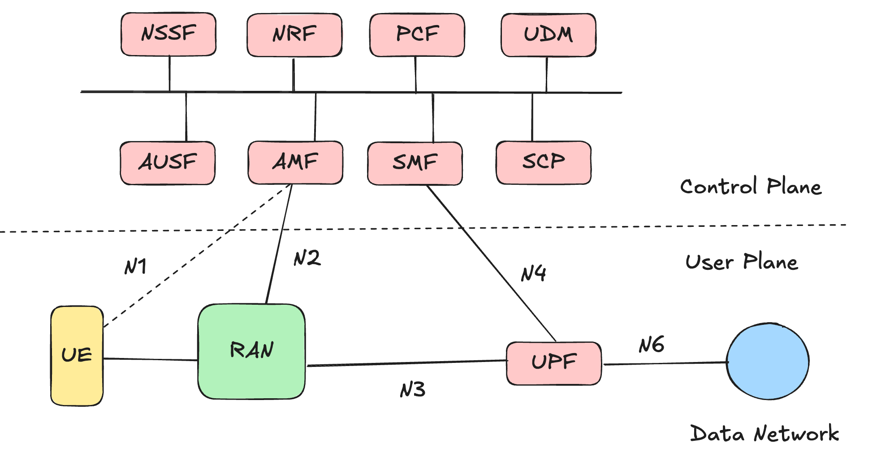
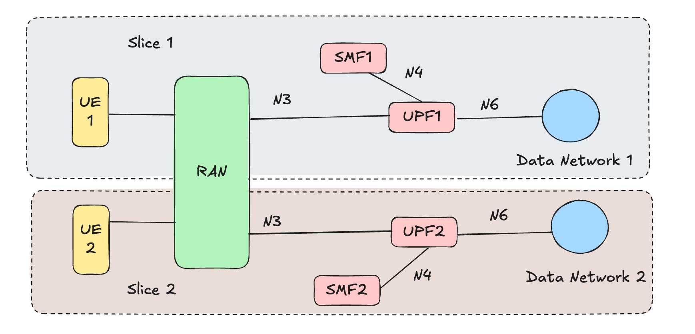
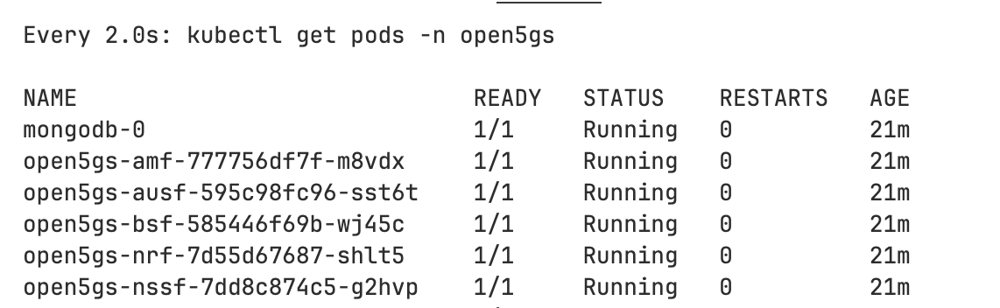
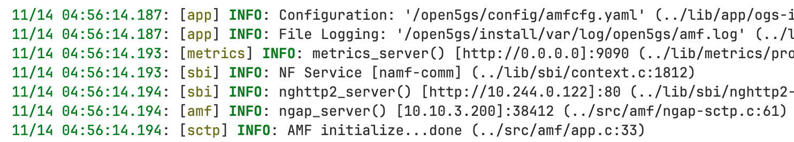
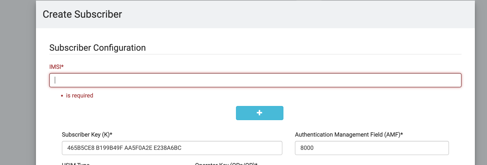
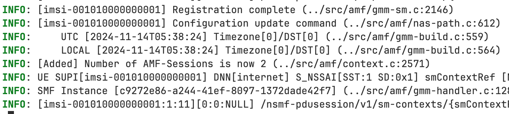
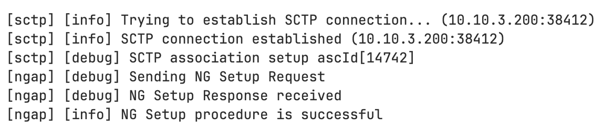
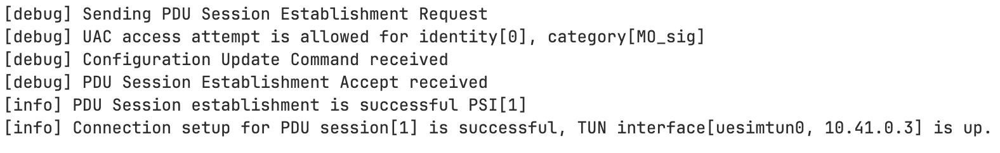
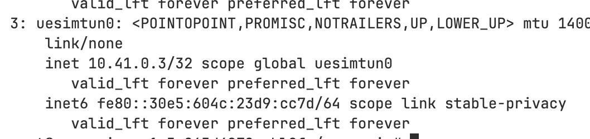
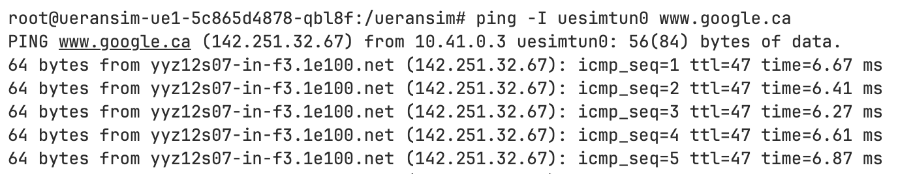

# Open5gs-k8s Overview
**Purpose**
Deploys the Open5GS core (3GPP R16 compliant) on Kubernetes.

**Key Features**
- **Microservices Architecture:** Each network function (NF) operates as an independent pod for modularity and scaling.
- **Network Slicing:** Configurable deployment supports two or more network slices. 
- **Software-define Networking:** Leverages Open vSwitch and Multus CNI for software-defined networking, compatible with OpenFlow controllers (e.g., ONOS).
- **Extensive Testing:** Validated with open-source projects (UERANSIM, OpenAirInterface, srsRAN) and tested on real hardware, including SDRs and COTS UEs.

---
# Deploying `open5gs-k8s`
Deployment involves 3 primary phases:

**1. Core Deployment:** Configure persistent storage and network attachment definitions. Deploy Open5GS core network functions in dedicated Kubernetes pods, along with the necessary services to facilitate inter-pod communication.

**2. Subscriber Management:** Add and manage subscribers through the Open5GS web-based GUI.

**3. RAN Deployment:** Deploy UERANSIM for simulated gNodeB and UE instances, facilitating end-to-end testing.

---
# Before Starting Deployment
**1. Navigate to the home directory** 
Use the `cd ~` command to ensure you’re starting from your home directory.

**2. Clone the `open5gs-k8s` repository**
Use `git clone` to fetch the source code from the Monarch GitHub repository.
```bash
git clone https://github.com/niloysh/open5gs-k8s.git
cd open5gs-k8s
```
**3. Set Up Your Testbed**
Make sure you’ve set up your testbed using the [Testbed Automator](https://github.com/niloysh/testbed-automator). Verify that all pods are in the `RUNNING` state.


---
# Phase 1 - Core Deployment

---
# 5G Core Network
<style> img[alt~="center"] { display: block; margin: 0 auto; } </style>

The 5G Core features a decomposed architecture, with each Network Function (NF) capable of registering for and subscribing to services offered by other NFs. **HTTP/2** is used as the primary communication protocol for these interactions.

The diagram below highlights key interfaces, including the `N2`, `N3`, and `N4` interfaces.



---
# Core Deployment Configuration (1/2)
Navigate to the `open5gs` directory, which contains two subdirectories: `common` and `slice`.

The `common` directory holds subdirectories for each network function (e.g., amf, smf). Each network function subdirectory contains:
- `deployment.yaml`: Defines the deployment for the network function, running the appropriate open5gs image.
- `service.yaml`: Configures the Kubernetes service for the network function, exposing the necessary ports, for example **port 80** for the NRF for communication with other NFs.
- `configmap.yaml`: Contains configuration settings specific to the network function. For example, the AMF configmap contains the supported **PLMN**.

---
# Core Deployment Configuration (2/2)
<style> img[alt~="center"] { display: block; margin: 0 auto; } </style>



The `slices` directory holds subdirectories for each slice. Each slice subdirectory in turn contains **UPF** and **SMF** NF subdirectories, consisting of `deployment`, `service`, and `configmap` files. 

There are two slices defined, as shown in the figure.


---
# Deploying the Core Network
**1. Run the deployment script**
```bash
./deploy-core.sh
```
This script will automatically perform the following tasks:
- **Setup persistent storage**: Deploy MongoDB and setup local persistence to store subscriber data and NF profile data.
- **Setup networking**: Deploy Multus network attachment definitions (NADs) for using OVS-CNI for the `N2`, `N3` and `N4` networks.
- **Deploy Kubernetes resources**: Deploy `deployments`, `configmaps`, and `services` for each network function in the core.

---
# Verifying Core Deployment (1/2)
All `open5gs-k8s` components are deployed in the `open5gs` namespace. While the core is being deployed, you can use `kubectl get pods -n open5gs` with the `watch` command in a **new terminal** to see the progress.
```bash
watch kubectl get pods -n open5gs
``` 



It can take a while for all pods to reach the `RUNNING` stage.

---
# Verifying Core Deployment (2/2)
Once all the pods are in the `RUNNING` stage, we can take a look at the logs.
For example, we can look at the AMF logs as follows:

```bash
kubectl logs open5gs-amf-<replace_id> -n open5gs
```


You should see logs similar to those seen above.

---
# Phase 2 - Subscriber Management
---
# Adding Subscribers using the Open5GS GUI (1/2)
Now that our core has been deployed, let's add some subscribers using the Open5GS GUI.

Navigate to http://localhost:30300/ and login with credentials: **username:** `admin` and **password:** `1423`. We can now add subscribers as shown.



---
# Adding Subscribers using the Open5GS GUI (2/2)

1. **Navigate to `data/sample-subscribers.md`**. You should see two subscribers, one for each slice. An example subscriber (Subscriber 1) is shown below:

    ```
    IMSI: 001010000000001
    Key: 465B5CE8B199B49FAA5F0A2EE238A6BC
    OPC: E8ED289DEBA952E4283B54E88E6183CA
    SST: 1
    SD: 000001
    DNN/APN: internet
    Type: ipv4
    ```
2. **Fill out the fields** using the GUI, leaving other fields at their default values.
**Note**: You can scroll down to get to `SST`, `SD` etc. Don't forget to set `Type` to `ipv4`.

---
# Phase 3 - RAN Deployment

---
# Deploying the RAN
**1. Run the deployment script**
```bash
./deploy-ran.sh
```
This script will automatically perform the following tasks:
- **Deploy the UERANSIM gNB**: Deploy the `deployment`, `service` and `configmap` for the UERANSIM gNodeB. 
- **Deploy the UERANSIM UEs**: Deploy two simulated UEs, one for each slice. These UEs have been pre-configured with the subscriber information you added earlier.

---
# Verifying the RAN Deployment (1/3)
In your terminal where the `kubectl get pods -n open5gs` command is running, you should observe a new pods for UERANSIM as shown below:


We can also check the AMF logs again. You should see something like this.



---
# Verifying the RAN Deployment (2/3)
Next, let's look at the gNodeB logs.
```bash
kubectl logs deployments/ueransim-gnb -n open5gs
```
Scroll to the top. You should see a successful `NG setup procedure` when the gNodeB connects to the AMF.



---
# Verifying the RAN Deployment (3/3)
To verify the RAN deployment, check the UE logs:

**1. View Logs:** Use the following command to view the logs for the ue1 pod:
```bash
kubectl logs deployments/ueransim-ue1 -n open5gs
```
**2. Check for PDU Session:** Look for a successful `PDU Session Establishment` message in the logs. You should also see the `TUN` interface being set up.



**3. Check IP Address:** The `10.41.X.X` IP address displayed in the logs is the IP assigned to the UE.

---
# Sending Traffic through the Slices (1/3)

With the RAN deployment complete, it's time to send traffic through the slices.

**1. Access UE Pod:** Open a shell on the `ue1` pod with the following command:

```bash
kubectl exec -it deployments/ueransim-ue1 -n open5gs -- /bin/bash
```

**2. Verify Interface:** Inside the pod, run `ip a` to check the interfaces. Look for the `uesimtun0` interface, which indicates the active PDU session and connection to the 5G network.



---
# Sending Traffic through the Slices (2/3)

To send traffic through the slice, perform a ping test to `google.ca` using the `uesimtun0` interface:
```bash
ping -I uesimtun0 www.google.ca 
```

You should see output similar to the screenshot below, indicating successful traffic transmission through the slice.


---
# Sending Traffic through the Slices (3/3)

To confirm the pings are routed through the 5G network, follow these steps:

**1. Access UPF1**: In a **new terminal**, open a shell on the UPF1 pod (connected to slice1):
```bash
kubectl exec -it deployments/open5gs-upf1 -n open5gs -- /bin/bash
```
**2. Check Interfaces:** Run `ip a` to see the tunnel interface representing the N3 GTP-U endpoint. Look for the `ogstun` interface with an IP address (e.g., 10.41.0.1/16).

**3. Capture Traffic:** Use `tcpdump` to capture packets on the tunnel interface:
```bash
tcpdump -i ogstun
```
You should see ping traffic like this:
```bash
18:34:29.550600 IP vpn-uw-ft-10-41-0-2 > yyz10s17-in-f3.1e100.net: ICMP echo request
```
---
# Next Steps
**Congratulations!**
You've successfully done the following:
- Completed the deployment of 5G core on Kubernetes.
- Learned how to add subscribers to the core network.
- Connected simulated gNodeB and UEs to network slices and sent traffic through them.

**What's Next?**
Dive deeper into the core configuration by continuing to [Lab 1](https://niloysh.github.io/open5gs-k8s/labs/lab1/README.pdf).